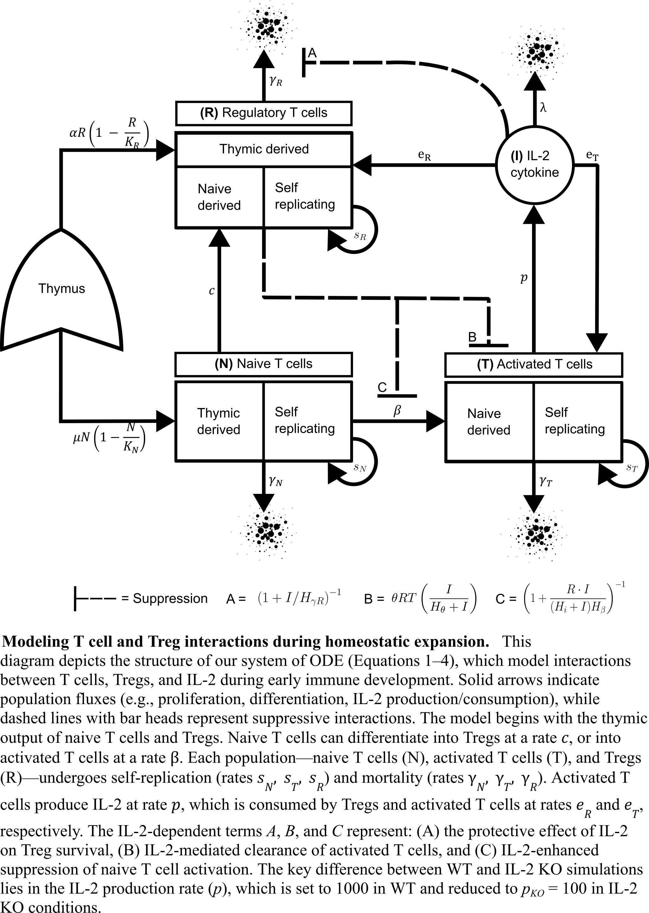

# Modeling the homeostatic expansion of the immune system in a healthy and autoimmune system
### Jonathan M. Anzules, Kristen M. Valentine, Genevieve N. Mullins,  Lihong Zhao, Anh L. Diep, Suzanne S. Sindi, Katrina K. Hoyer.

This project explores the systemic differences between a healthy and autoimmune system. We represent the homeostatic dynamics that work properly during healthy development and the cascading failure seen in the IL-2 knock system that leads to autoimmune disease. Below is a diagram of the model:



-------------------------

## Where to Start
The QuickSimulation.m script is the easiest bit of code to go in and start exploring the dynamics of the model. Improvements to the accessibility of this script is planned for the future.

#### Below is a file tree of the most important parts of my project:


<!-- ```
HomeostaticExpaction
|...Modeling
|    |...Matlab
|    |    |...CodesFrom_Khailaie2013
|    |    |...Matlab
|    |        |...RawData
|    |        |...Residuals
|    |        |...Examples
|    |        |...Plots
|    |        |...WorkingScript
|    |            |...ModelandCellGrowth.m
|    |            |...QuickSimulation.m
|    |            |...LHSInitialConditions.m
|    |            |...LHSParameters.m
|    |        |...Data
|    |...Python (Python Version, WIP by Pheobe Adamyan)
|
|...Stats plots and data management
    |...popCount_V2.R
    |...CalculatingActivatedTCellsFromCD44.py
    |...poCount_V2_AfterPythonScript.R
    |...StatsForPopCount_V2Results.Rmd
``` -->

## Defining Folders and Scripts
1. **Code Folder** - Contains the scripts that run the simulation, optimization/minimizing algorithm, and sensitivity analysis. 
2. **RawData Folder** - Contains the data that my model attempts to replicate. Analyzed and prepared by scripts in the folder "Stats plots and data management"
3. Main Scripts definition
        * **ModelandCellGrowth.m** - The main script for minimizing the Rsquare value calculated by comparing the the simulation to the data.
        * **QuickSimulation.m** - Runs a simulation with the chosen parameter set and time frame. Plots are created for each run, if so desired. Individual values for each parameters can be edited to study the dynamics of the model
        * **LHSInitialConditions** - Performs a Latin hypercube sampling of any given population initial conditions and range. The 90th/10th percentile and one standard deviation above and below the mean is calculated. Plots displaying the area that the simulation results take is made for either percentiles or percentages.
        * **LHSParameters** - Performs a Latin hypercube sampling of any given parameter and a chosen range. The 90th/10th percentile and one standard deviation above and below the mean is calculated. Plots displaying the area that the simulation results take is made for either percentiles or percentages.
    * **Data** - Contains the data related to minimization/optimization, the most interesting parameter sets, and notes
        * **ObjectiveDataKO.csv, ObjectiveDataWT** - Contains all the data used for the calculation of the best parameter set chosen by fmincon(). This was used to explore how the data was used to calculate the objective, used for sanity checks.
        * **ParametersSets.csv** - Collection of parameters the display the most interesting dynamics seen in the model and progression towards the best fit of the model to data.


